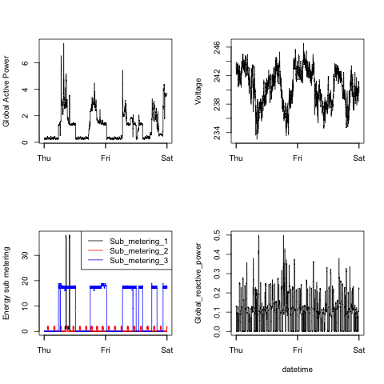

## ExData README

This repository includes content for programming assignment \#1 for the Johns Hopkins University Exploratory Data Analysis course on Coursera. For assignment 1, students were asked to produce four plotting scripts in R, each of which produced a single portable network graphics image of 480px by 480px. Instructions for the assigment are located at https://github.com/rdpeng/ExData_Plotting1.

The key data transformation required to produce the charts is to combine the Date and Time variables from the input file into a single datetime field. All other variables in the input file can be used directly as they were loaded from the input file.

Each R script must read the raw data, subset it to include only the first two days of February, 2007. The subsetted data set includes 2,880 observations, one for each minute of each day.  

## Repository Contents
<table>
<tr>
<th>File Name</th><th>Description</th></tr>
<tr><td valign=top>plot1.R</td><td>Produces a histogram of Global Active Power, with labels as illustrated in the course instructions.</td></tr>
<tr><td valign=top>plot2.R</td><td>Produces a line plot of Global Active Power, with labels as illustrated in the course instructions.</td></tr>
<tr><td valign=top>plot3.R</td><td>Produces a multi-line plot of the three Sub metering variables, with labels and a legend in the upper right corner of the chart, as illustrated in the course instructions.</td></tr>
<tr><td valign=top>plot4.R</td><td>Produces a chart that combines four plots including:
<ul>
<li>upper left:  datetime by Global active power</li>
<li>upper right: datetime by Voltage</li>
<li>lower left:  datetime by Engergy sub metering</li>
<li>lower right: datetime by Global reactive power</li>
</ul>
with labels as illustrated in the course instructions.</td></tr>
<tr><td>plot1.png</td><td>Portable network graphics file output from plot1.R</td></tr>
<tr><td>plot2.png</td><td>Portable network graphics file output from plot2.R</td></tr>
<tr><td>plot3.png</td><td>Portable network graphics file output from plot3.R</td></tr>
<tr><td>plot4.png</td><td>Portable network graphics file output from plot4.R</td></tr>
<tr><td>README.md</td><td>This file, summarizing the work completed for the programming assignment.</td></tr>
</table>

## Results
The output from each R script is displayed here, and matches the content from the [Assignment 1 Instructions](https://github.com/rdpeng/ExData_Plotting1/blob/master/README.md). Also, each PNG file was checked in a graphics file editor to confirm that it is 480px x 480px. 

### Plot 1

### Plot 2

### Plot 3

### Plot 4

